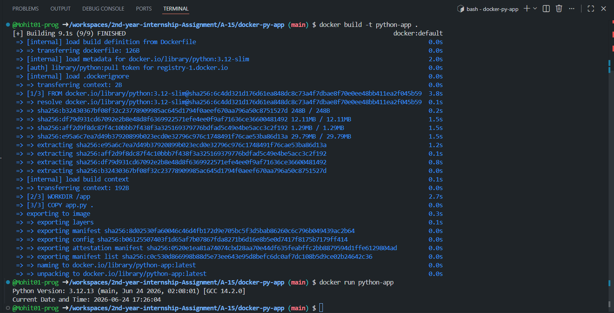

# Dockerized Python Application

This project demonstrates a simple Dockerized Python application using the official Python 3.12 Slim image.

## Features

Uses `python:3.12-slim` as base image
Displays:
 Current Python Version
 Current Date and Time
 Automatically executes when the container starts

## Project Structure

```text
docker-py-app/
├── app.py
├── Dockerfile
├── image.png
├── README.md
└── requirements.txt
```


## Build Docker Image

```bash
docker build -t python-app .
```

## Run Docker Container

```bash
docker run --rm python-app
```

## Sample Output

```text
Python Version: 3.12.11 (main, ...)
Current Date and Time: 2026-06-24 17:26:04
```

## Screenshot



## Author

Mohit Garg